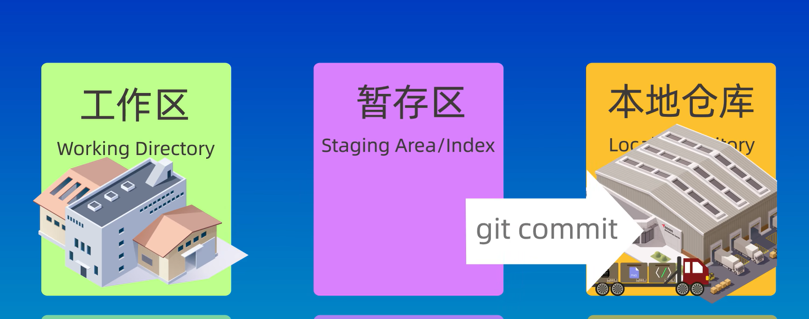
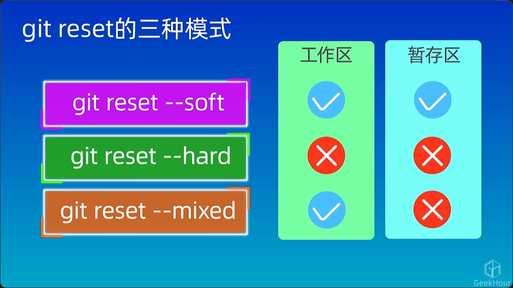

# Git学习

[返回主页](/ "qaq不要走")

## 三个区
### 工作区
工作区就是指当前的目录，用ls命令查看到的就是工作区的内容  
*工作区就是生产车间*
### 暂存区
*暂存区就是小货车*，~~用git ls-files就能查看暂存区内容~~ 并非，这个命令是查看所有被跟踪的文件，不只是暂存区的
### 仓库区
*就是存储仓库*

## 三个区之间的“货物”流转
### `git add` 工作区到暂存区

这个是可以一个文件一个文件地往货车上搬运的，与后面的`git commit`不同  
`git add .`表示提交当前目录的所有文件
### `git commit` 暂存区到仓库
可选参数：`--m <提交版本说明>`

与git add不同，这个直接是把一整个货车上的货物卸到仓库里。
## Git reset 回退版本
### `git reset --soft <上一个版本的ID>`:
回退到某个版本，保留工作区和暂存区的内容
### `git reset --hard <上一个版本的ID>`:
回退到某个版本，丢弃工作区和暂存区的内容
### `git reset --mixed <上一个版本的ID>`:
回退到某个版本，保留工作区内容丢弃暂存区的内容

## 文件的状态

## `git diff`
查看差异

默认查看工作区和暂存区两个区之间的差异  
但若加上`HEAD`,就表示比较工作区和版本库之间的差异  
***HEAD表示版本库的指针***  
### 加上`--cached`表示比较暂存区和版本库之间的差异
### git diff还能用于比较两个特定的版本库之间的差异。
在`git diff`后加上两次提交的id即可
### `git diff`搭配head

***在以上介绍的所有`git diff ...`命令的后面还可以加上特定的文件名，那么就会只查看这个文件的差异***
### *git diff summary*

## 从版本库中删除文件
### 方法1(不推荐)：在工作区删除，然后提交
现在工作区中删除，然后提交到暂存区中，再提交
### 方法2：`git rm`然后提交
参数：`--cached`，表示只删除暂存区，不删除工作区

## .gitignore
用于忽略一些文件，不提交到版本库中。**前提：这些文件不能是已经被添加到版本库中的！***这个文件本身也需要提交*

使用方法是，只需要创建这个.gitignore文件，再把需要忽略的文件名或者文件夹名**文件夹最后要加斜线**输入其中即可。***支持通配符***，即类似`*.log`

## 远程仓库
远程连接有两种方式，HTTPS和SSH协议，前者已停用，所以使用后者。使用后者需要配置SSH密钥。  
1. 先检查本地主机是否已经存在ssh key。  
`cd `到用户名录，ls查看有无.ssh文件夹，如有，看里面是否存在 id_rsa 和 id_rsa.pub文件，如果存在，说明已经有SSH Key。存在的话直接跳转到第三步。
2. 生成SSH Key

        ssh-keygen -t rsa -C "xxx@xxx.com"
        //执行后一直回车即可
    生成完以后再去查看。
  
前面那个是私钥，后面那个是公钥
3. 获取ssh key公钥内容（id_rsa.pub）  
   `cat id_rsa.pub`，并复制
4. github账号添加公钥

接着就可以克隆啦
### 本地仓库和远程仓库的关联

## 常用命令
### `git status`
查看仓库目前的状态。
### `git log (--oneline)`
查看仓库的提交日志。若加上`--oneline`参数，则表示以精简形式显示。
### `git ls-files`
查看被跟踪的文件。
