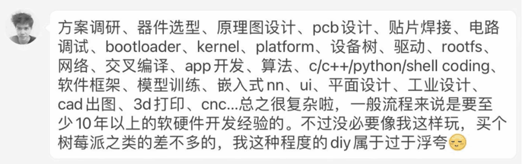

# ***markdown学习***

[返回主页](/ "qaq不要走")

## 标题语法
*前面加井号即可，一共有6级。*

## 段落语法
*创建段落，用空白行分割。* 如：  
这句话的下面将会是一个段落分割：

这句话的上面是一个段落分割。

## 换行语法
*在一行的末尾添加两个或多个空格即可换行。* 如：  
这是前一行的末尾  
这是后一行。  
需要注意，**直接回车是不会换行的。** 比如：  
接下来我会直接输入一个回车：
但是，可以看到没有换行。

## 强调语法
### 粗体
*要加粗文本，请在单词或短语的前后各添加两个星号*  ，如：  
**我喜欢粗体！**  
### 斜体
*要用斜体显示文本，请在单词或短语前后添加一个星号*，如：  
*我喜欢斜体！*  
**注意！最好在星号的后面再加一个空格，不然直接接以后的文本可能会出错。**
### 粗体+斜体
*要同时用粗体和斜体突出显示文本，请在单词或短语的前后各添加三个星号*。如：  
***我喜欢粗体和斜体！***

## 引用语法
*要创建块引用，请在段落前添加一个 > 符号。*，如：  
> 这句话不是我说的。  

多个段落的块引用：*段落之间的空白行添加一个 > 符号。*如：
> 这句话不是我说的。
>
> 这句话也不是我说的。

嵌套块引用，如：
> 我是引用！
>> 我是引用的引用！
>>> 我是引用的引用的引用！

## 列表语法
### 有序列表
*要创建有序列表，请在每个列表项前添加数字并紧跟一个英文句点。数字不必按数学顺序排列，但是列表应当以数字 1 起始*，如：
1. 表项1
7. 表项2
1000. 表项3
      1.    表项3子项1
      2.    表项3子项2
      3.    表项3子项3

**注意！有序列表的嵌套一定要先写数字再用tab，否则很可能出错。**
### 无序列表
*要创建无序列表，请在每个列表项前面添加破折号 (-)、星号 (***) 或加号 (+) 。缩进一个或多个列表项可创建嵌套列表*，如：  
+ 表项1
+ 表项2
+ 表项3
  + 表项3子项1
  + 表项3子项2
    + 表项3子项2子项1

## 代码语法
1. *要将单词或短语表示为代码，请将其包裹在反引号 (``) 中。* 如：  
在C语言中，用于打印的函数是`printf()`。  
**转义反引号：** *如果你要表示为代码的单词或短语中包含一个或多个反引号，则可以通过将单词或短语包裹在双反引号(````)中。*
2. 代码块。*要创建代码块，请将代码块的每一行缩进至少四个空格或一个制表符。* 如：

        #include "stdio.h"
        printf("hello, world")
   **可见，代码块最好与其上面有所分割。**

## 分割线语法
*要创建分隔线，请在单独一行上使用三个或多个星号。***为了兼容性，请在分隔线的前后均添加空白行。*** 如：

***

## 链接语法
*链接文本放在中括号内，链接地址放在后面的括号中，链接title可选。
超链接Markdown语法代码：*

    更多信息，请访问[markdown学习网站](https://markdown.com.cn/basic-syntax/links.html "鼠标放在蓝色链接上就会显示我，我就是title")

### 网址和Email地址
*使用尖括号可以很方便地把URL或者email地址变成可点击的链接。* 如：
<https://markdown.com.cn>  
<fake@example.com>  
链接是可以使用前面的格式化（如加粗，斜体等）的。如：
[*markdown学习网站*`哇哇`](https://markdown.com.cn/basic-syntax/links.html "真的是你呀！")  

## 图片语法
*要添加图像，请使用感叹号 (!), 然后在方括号增加替代文本，图片链接放在圆括号里，括号里的链接后可以增加一个可选的图片标题文本。*  
插入图片Markdown语法代码：

    
如：  




### 链接图片
*给图片增加链接，请将图像的Markdown 括在方括号中，然后将链接添加在圆括号中。* 示例代码：

    [](https://markdown.com.cn)

[](https://markdown.com.cn)

## 转义字符语法
*要显示原本用于格式化 Markdown 文档的字符，请在字符前面添加反斜杠字符 \ 。* 如：  
\*我不喜欢斜体。\*  
以下列出的字符都可以通过使用反斜杠字符从而达到转义目的。


## 表格
*要添加表，请使用三个或多个连字符（---）创建每列的标题，并使用管道（|）分隔每列。您可以选择在表的任一端添加管道。* 如：  
|学号|班级|姓名|
|---|---|---|
|12345667|1|啊啊啊啊砍柴|
### 对齐
*您可以通过在标题行中的连字符的左侧，右侧或两侧添加冒号（:），将列中的文本对齐到左侧，右侧或中心。*  
|学号|班级|姓名|
|:---|:---:|---:|
|1|2|3|  
